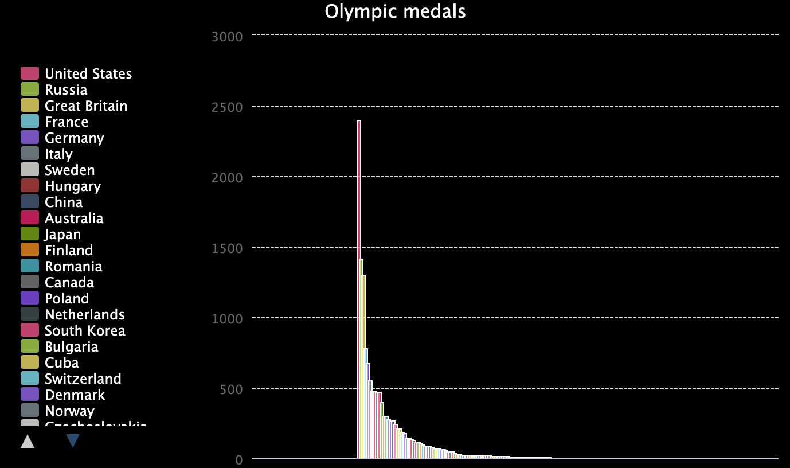

<h2 class="c-project-heading--task">STEP TITLE</h2>
--- task ---
BRIEF SUMMARY OF STEP - one line
--- /task ---

<h2 class="c-project-heading--explainer">PROBABLY UNNECCESARY TITLE</h2>

SHORT INSTRUCTIONS

--- code ---
---
language: python
filename: main.py
line_numbers: true
line_number_start: 
line_highlights: 
---
CODE THEY WRITE HERE
--- /code ---

<pre>WHAT THEY SHOULD SEE IF OUTPUT IS TEXT - OTHERWISE USE IMAGE</pre>

### Tip

BULLET POINT TIPS HERE (OPTIONAL)

### Debugging

BULLET POINT DEBUG POINTS HERE (OPTIONAL)

  <a class="c-survey-banner__link" href="https://form.raspberrypi.org/f/code-editor-feedback" target="_blank">Take our survey</a> to help make our Code Editor better!

## You will make

Discover the power of lists in Python by creating an interactive chart of Olympic medals.

**The Olympic Games** began in 1896: thousands of athletes represent hundreds of nations from around the world. The modern games were inspired by ancient contests held in Olympia, Greece.

You will:
 - Use **lists** to store related data
 - Create a **chart** using the `pygal` library
 - Load data by having your program **read a file**

--- no-print ---
--- task ---
### Play ▶️

  
Run the program to load the chart. Notice that the chart is interactive. What happens when you click on the top three nations in the key on the left?

<iframe src="https://editor.raspberrypi.org/en/embed/viewer/charting-champions-example" width="600" height="600" frameborder="0" marginwidth="0" marginheight="0" allowfullscreen>
</iframe>

--- /task ---
--- /no-print ---

--- print-only ---

--- /print-only ---

