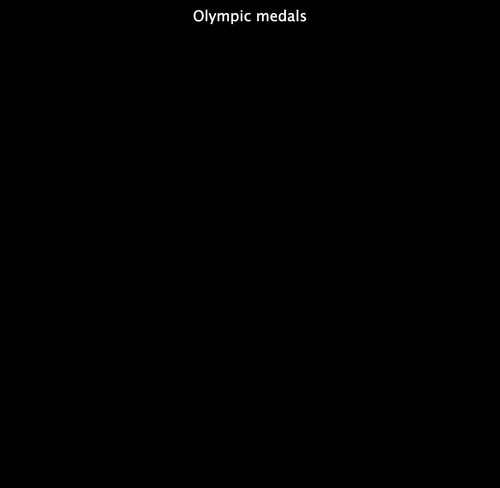
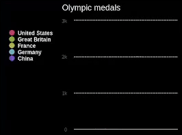

## Make a chart

<div style="display: flex; flex-wrap: wrap">
<div style="flex-basis: 200px; flex-grow: 1; margin-right: 15px;">
Create a chart and some lists of data to display on it.
</div>
<div>
{:width="300px"}
</div>
</div>

--- task ---

Open the [Charting champions starter project](https://editor.raspberrypi.org/en/projects/charting-champions-starter){:target="_blank"}. The Raspberry Pi code editor will open in another browser tab.

If you have a Raspberry Pi account, you can click **Save** to save a copy of the starter code to your library.

If you are not using the code editor in your browser, you will need to download the project files and you may need to install `pygal` before you can import it.

--- collapse ---

---
title: Offline project files
---

Download the project files, unzip them, and store them on your computer. For this step you will need `starter.py`, the other files will be used later in the project.

--- /collapse ---

--- collapse ---
---
title: Installing pygal
---

### On Windows
In the **Command Prompt** type the following and press the <kbd>Enter</kbd> key:

```
pip install pygal
```

Wait for the installation to complete and then continue with the project.

### On a Mac
In the **Terminal** type the following and press the <kbd>Enter</kbd> key:

```
pip3 install pygal
```

Wait for the installation to complete and then continue with the project.

### On Linux, including Raspberry Pi OS
In the **Terminal** type the following and press the <kbd>Enter</kbd> key:

```
pip install pygal
```

Wait for the installation to complete and then continue with the project.

--- /collapse ---

--- /task ---

The starter project already has some code to import the `pygal` library, which you will use to draw your chart.

--- code ---
---
language: python
filename: main.py
line_numbers: true
line_number_start: 1
line_highlights: 1
---

from pygal import bar

--- /code ---

### Make a chart

--- task ---

Find the `# Create a chart` comment and add code below it to make a bar chart called `chart`, inside the brackets give your chart a title.

--- code ---
---
language: python
filename: main.py
line_numbers: true
line_number_start: 4 
line_highlights: 5
---
# Create a chart
chart = Bar(title='Olympic medals')

--- /code ---

--- /task ---

--- task ---

Call `chart.render()` to display the chart.

--- code ---
---
language: python
filename: main.py
line_numbers: true
line_number_start: 11 
line_highlights: 12
---
# Display the chart
chart.render()
--- /code ---

--- /task ---

--- task ---

**Test:** Run your code to see the chart. It will be empty because it doesn't have data yet.

{:width="300px"}

**Debug**: If you see an error about `Bar()` or `chart.render()` being `not defined`:

 - If the error is for `Bar()`, make sure it has an uppercase B at the start, and brackets at the end
 - If the error is for `chart.render()`, check that it has the `.` between `chart` and `render`, as well as the brackets at the end

**Debug**: If you are not using the Raspberry Pi code editor, and the graph hasn't appeared when you run your code, replace `chart.render()` with `chart.render_in_browser()`.

--- /task ---

### Add some data

Python can store related data as a **list**. You can create lists by using square brackets `[]`. Items in a list are separated with commas.

--- task ---

Create three lists of data to show on your chart.

Each list will store a nation's name and the number of medals won by that nation. 

--- code ---
---
language: python
filename: main.py
line_numbers: true
line_number_start: 7 
line_highlights: 8-10
---
# Add data to the chart
us = ['United States', 2399]
gb = ['Great Britain', 1304]
fr = ['France', 751]

--- /code ---

--- /task ---

When you store something in a list, it gets an **index**. An index is a number that tells you an item's position in a list. List indexes start from `0`, instead of `1`.

--- task ---

You can get an item from a list by its index. For example, `my_list[3]` will get the **fourth** item in `my_list`, because indexes start at `0`.

Use the indexes of your lists and `chart.add()` to display your data. The nation's name at item 0 will be used as a category label for the chart and the amount of medals at item 1 will determine the height of the bar.

--- code ---
---
language: python
filename: main.py
line_numbers: true
line_number_start: 10 
line_highlights: 12-14
---
gb = ['Great Britain', 1304]

chart.add(us[0], us[1])
chart.add(gb[0], gb[1])
chart.add(fr[0], fr[1])

--- /code ---

--- /task ---

--- task ---

**Test:** Run your code to see the chart.

{:width="300px"}

**Debug**: If you see a message about an `IndexError`, your code is trying to get a value from a list index that doesn't exist (e.g. `us[2]`). To fix this:
 - Check each of your `chart.add` lines to be sure you are only using `0` and `1` as indexes.
 - Check the lines where you created your lists. Make sure each list has two items, separated by a comma.

--- /task ---

--- task ---

Now load two more teams by adding new lists and `chart.add()` calls.

--- code ---
---
language: python
filename: main.py
line_numbers: true
line_number_start: 7 
line_highlights: 11-12, 17-18
---
# Add data to the chart
us = ['United States', 2399]
gb = ['Great Britain', 1304]
fr = ['France', 751]
ge = ['Germany', 655]
ch = ['China', 636]

chart.add(us[0], us[1])
chart.add(gb[0], gb[1])
chart.add(fr[0], fr[1])
chart.add(ge[0], ge[1])
chart.add(ch[0], ch[1])

--- /code ---

--- /task ---

--- task ---

**Test:** Run your code to see the updated chart. Try clicking on the United States' name. Then watch the scale of the chart change.

{:width="300px"}

**Debug**: If you see a message about an `IndexError`, your code is trying to get a value from a list index that doesn't exist (e.g. `fr[2]`). To fix this:
 - Check each of your `chart.add` lines to be sure you are only using `0` and `1` as indexes.
 - Check the lines where you created your lists. Make sure each list has two items, separated by a comma.

--- /task ---

--- save ---
