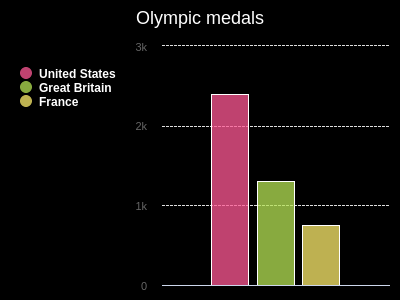

<h2 class="c-project-heading--task">Add data</h2>
--- task ---
Get data into your chart
--- /task ---

<h2 class="c-project-heading--explainer">Create lists</h2>

Python stores data as a **list**. You can create lists by using square brackets `[]` and items are separated with commas.

Create three lists of data to show on your chart. Each list stores a nation name and the number of medals.

 
--- code ---
---
language: python
filename: main.py
line_numbers: true
line_number_start: 6 
line_highlights: 7-9
---
# Add data to the chart
us = ['United States', 2399]
gb = ['Great Britain', 1304]
fr = ['France', 751]
--- /code ---

<h2 class="c-project-heading--explainer">Indexes</h2>

When you store items in a list, each item has an **index**. 
An index is a number that shows where an item is in the list.
Indexes start at 0.

You use an index to get an item from a list.

- us[0] returns 'United States'
- us[1] returns 2399

Use list indexes with chart.add() to show your data. Item 0 is the label and item 1 sets the bar height.

--- code ---
---
language: python
filename: main.py
line_numbers: true
line_number_start: 11
line_highlights: 11-13
---
chart.add(us[0], us[1])
chart.add(gb[0], gb[1])
chart.add(fr[0], fr[1])
--- /code ---

**Run** your code to see the data in the chart.

{:width="300px"}

### Debugging

If you see a message about an `IndexError`, your code is trying to get a value from a list index that doesn't exist (e.g. `us[2]`). To fix this:
 - Check each of your `chart.add` lines to be sure you are only using `0` and `1` as indexes.
 - Check the lines where you created your lists. Make sure each list has two items, separated by a comma.

