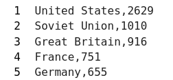
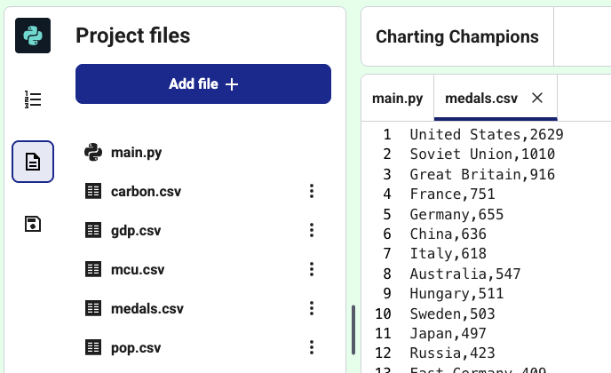

<h2 class="c-project-heading--task">Large datasets</h2>
--- task ---
Load data from a CSV file
--- /task ---

The chart looks good! But, almost 150 nations have competed in the Olympics. To chart them, you're going to load their data from a file. It will save a lot of typing!

### Tip

**CSV files** are Comma-Separated Values files. They contain data in rows and columns, like a table. Each line is a row, with commas separating that row's values into columns.

There are several `.csv` files included in this starter project that contain the data you need for your charts.

Open `medals.csv` and look at the data in it. See how each line has a team name and the number of medals they have won, separated by a comma. 
{:width="200px"}

<h2 class="c-project-heading--explainer">PROBABLY UNNECCESARY TITLE</h2>

--- code ---
---
language: python
filename: main.py
line_numbers: true
line_number_start: 
line_highlights: 
---
CODE THEY WRITE HERE
--- /code ---

<pre>WHAT THEY SHOULD SEE IF OUTPUT IS TEXT - OTHERWISE USE IMAGE</pre>

### Tip

### Debugging

BULLET POINT DEBUG POINTS HERE (OPTIONAL)

You'll need to turn each line of `medals.csv` into a text string and a number in Python, like in the lists you made.

--- task ---

Click on the `main.py` tab and add code to load the file into a variable by using `with open() as`. Then use a `for` loop to `print` each line from the variable.

The `for` loop will let you repeat code. So you will load hundreds of teams to your chart with just a few lines of code!

[[[generic-python-file-read]]]

--- code ---
---
language: python
filename: main.py
line_numbers: true
line_number_start: 8 
line_highlights: 9-11
---
# Add data to the chart
with open('medals.csv') as f:
    for line in f:
        print(line)
--- /code ---

--- /task ---

--- task ---

**Test:** Run your code and look at the text it prints out. 

Notice that each line has two values, separated by commas.

**Debug:** If the code doesn't work, make sure you have indented it under the `with` line, like in the example above.

--- /task ---
