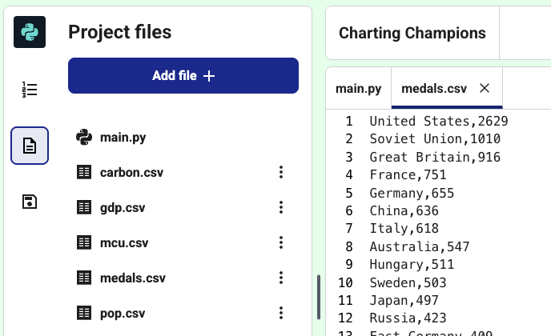
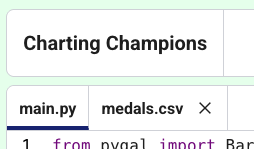
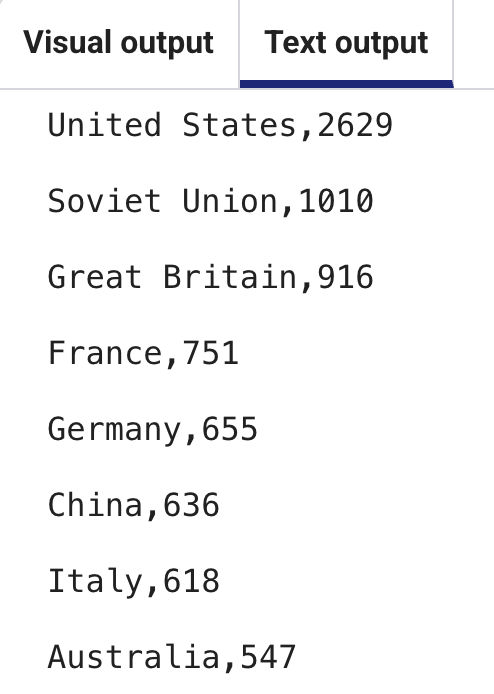

<h2 class="c-project-heading--task">Large datasets</h2>

Load bigger datasets from a CSV file

<h2 class="c-project-heading--explainer">Follow these instructions</h2>

## Step 1

The chart looks good, but nearly 150 nations have competed in the Olympics. Instead of typing them all, you can load the data from a file.

### CSV files

CSV stands for **C**omma-**S**eparated **V**alue.
There are several `.csv` files included in this starter project that contain the data you need for your charts.

Open `medals.csv` and look at the data in it. See how each line has a team name and the number of medals they have won, separated by a comma.

You'll need to turn each line of `medals.csv` into a text string and a number in Python, like in the lists you made.

## Step 2

Click on the **main.py** tab.

{:width="250px"}

Add code to load the file by using `with open() as`. Then use a `for` loop to `print` each line from the file.

The `for` loop lets you repeat code, so you can load hundreds of teams into your chart with just a few lines of code.

[[[generic-python-file-read]]]

--- code ---
---
language: python
filename: main.py
line_numbers: true
line_number_start: 6
line_highlights: 7-9
---
# Add data to the chart
with open('medals.csv') as f:
    for line in f:
        print(line)
--- /code ---

## Step 3

**Run** your code and look at the text it prints out in the **Text output** tab.

Notice that each line has two values, separated by commas.

{:width="300px"}

**Debug:** If the code doesn't work, make sure you have indented it under the `with` line, like in the example above.

## Now run your code

Run your code and check that the **Text output** shows the medal data printed one line at a time, with a comma in each line.
