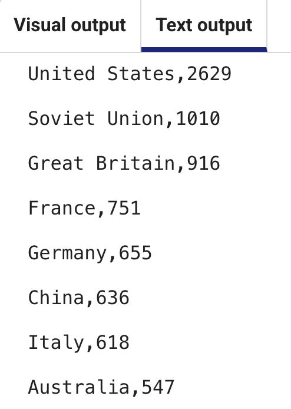

<h2 class="c-project-heading--task">Reading CSV data</h2>
--- task ---
Read the data from `medals.csv` using Python.
--- /task ---

Click on the **main.py** tab, and **delete** the lists and indexes from lines 7-17.

Add the following code.

Use `with open()` to open a file and a `for` loop to repeat `print`. The loop ends when there are no more lines in the file.

--- code ---
---
language: python
filename: main.py
line_numbers: true
line_number_start: 6 
line_highlights: 7-9
---
# Add data to the chart
with open('medals.csv') as f:
    for line in f:
        print(line)
--- /code ---

**Run** your code to see the text from print out in the **Text output** tab. 

