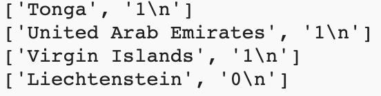

<h2 class="c-project-heading--task">Split values</h2>
--- task ---
Load large data sets from a file to save a lot of typing!
--- /task ---

each string that your loop prints is made up of two pieces separated by a comma. Your `chart.add()` function needs each of those pieces as separate inputs.

The `split()` function breaks a string into a list, just like the lists you made earlier. The `split(',')` function makes a new list item every time it sees a comma.

--- task ---

Put a `#` in front of the code that prints `line`. This will turn that code into a comment, so Python will ignore it. 

Use the `split()` method to break up each sting at a `,` and then store the first and second pieces in a new list. Then print those lists out.

--- code ---
---
language: python
filename: main.py
line_numbers: true
line_number_start: 9 
line_highlights: 12-13
---
with open('medals.csv') as f:
    for line in f:
        #print(line)
        pieces = line.split(',') # Breaks the string into a list
        print(pieces) # Print each list
--- /code ---

**Tip:** `split()` can split a string into a list around any text you want. You can split on punctuation, a letter, or even whole words.

--- /task ---

--- task ---

**Test:** Run your code and look at the text it prints out. Each line should be a list with two items. You may notice that the second item has `\n` at the end. `\n` is usually invisible. It tells the computer it has reached the end of the line in a file.

{:width="400px"}

**Debug:** If your `pieces` are printing out as lists with only one item then check that you have `','` in the `()` of `line.split()`.

**Debug:** If you see a message about `split` being 'not defined', check that you have included `line.` before it.

--- /task ---

