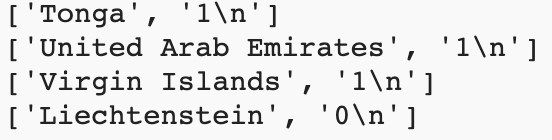

<h2 class="c-project-heading--task">Split into lists</h2>

Use `split(',')` to make a new list item every time there is a comma

<h2 class="c-project-heading--explainer">Follow these instructions</h2>

## Step 1

Each string that your loop prints is made up of two pieces separated by a comma. Your `chart.add()` function needs each of those pieces as separate inputs.

The `split()` function breaks a string into a list, just like the lists you made earlier. The `split(',')` function makes a new list item every time it sees a comma.

## Step 2

Put a `#` in front of the code that prints `line`. This will turn that code into a comment, so Python will ignore it.

Use the `split()` method to break up each string at a `,` and then store the first and second pieces in a new list. Then print those lists out.

--- code ---
---
language: python
filename: main.py
line_numbers: true
line_number_start: 7
line_highlights: 10-11
---
with open('medals.csv') as f:
    for line in f:
        #print(line)
        pieces = line.split(',') # Breaks the string into a list
        print(pieces) # Print each list
--- /code ---

### Tip

You may notice that the second item has `\n` or `\r\n` at the end. This tells the computer it has reached the end of the line in a file.

## Step 3

**Run** your code and look at the text it prints out in the **Text output** tab. Each line should be a list with two items.

{:width="400px"}

### Debugging

If your `pieces` are printing out as lists with only one item, check that you have `','` in the `()` of `line.split()`.

If you see a message about `split` being `not defined`, check that you have included `line.` before it.

## Now run your code

Run your code and check that each line in **Text output** is now shown as a list with two items.
