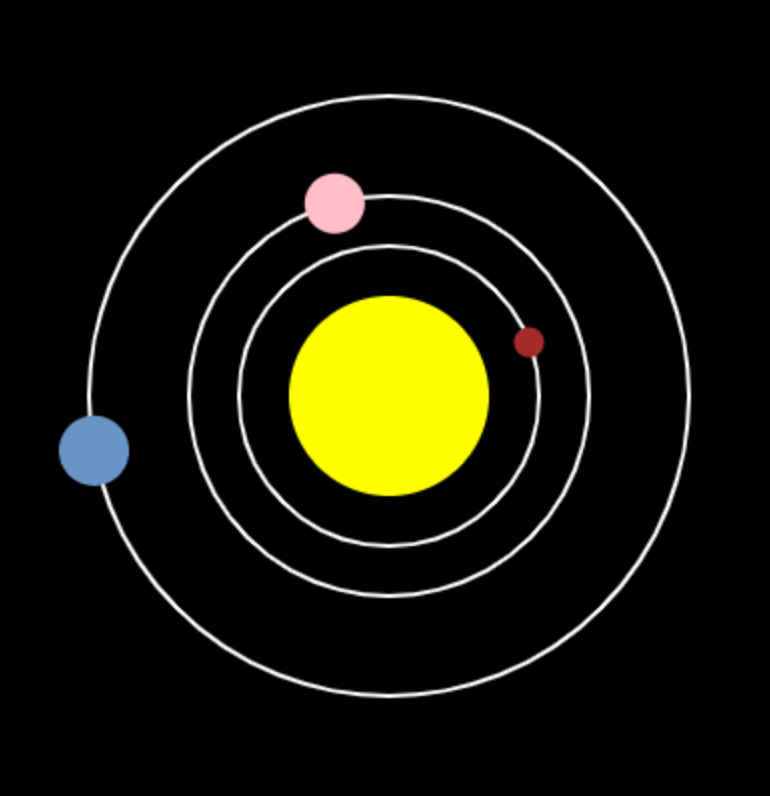

## What next?

If you are following the [More Python](https://projects.raspberrypi.org/en/pathways/more-python) path, you can move on to the [Solar system](https://projects.raspberrypi.org/en/projects/solar-system-simulator/) project. In that project, you will make a model of the solar system to teach people about the planets.

--- print-only ---

--- /print-only ---

--- no-print ---

<iframe src="https://editor.raspberrypi.org/en/embed/viewer/solar-system-example" width="600" height="600" frameborder="0" marginwidth="0" marginheight="0" allowfullscreen>
</iframe>

--- /no-print ---

If you want to have more fun exploring Python, then you could try out any of [these projects](https://projects.raspberrypi.org/en/projects?software%5B%5D=python).
