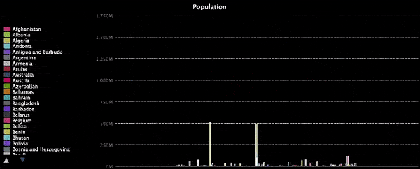

<h2 class="c-project-heading--task">Investigating data</h2>
--- task ---
Use different files to compare data
--- /task ---

## Investigate with data

Now your program can draw charts from files of data. You can use it on different files to compare their charts to see what you can learn.

{:width="300px"}

### Who has the most medals?

--- task ---

Look at the chart you've made. The taller a bar is, the more medals that team has won. Hover the mouse over some of the tallest bars and notice which teams they belong to. 

{:width="500px"}

Why might they have the most medals?

--- /task ---

A good idea might be to look at both the population and wealth of teams, to see if there is any sort of pattern.

**Data analysis:** People have done these kinds of investigations since long before computers were invented. For example, in the 1850s, Florence Nightingale, a nurse, used charts and graphs to show the importance of disease prevention in caring for the sick. 
{:width="300px"}

### Population sizes

A file, called `pop.csv`, with data on the populations of different countries, is part of the starter project. Because the data in `pop.csv` is also made up of a text string and a number, you can re-use your code with only small changes.

--- task ---

Change the chart title, the `width` of the chart, the file you are opening, and the category name to draw a chart based on the population data in `pop.csv`.

--- code ---
---
language: python
filename: main.py
line_numbers: true
line_number_start: 6 
line_highlights: 6, 9, 15, 16
---
chart = Bar(title='Population', width='600')

# Add data to the chart
with open('pop.csv') as f:
    for line in f:
        #print(line)
        pieces = line.split(',')
        #print(pieces)
        team = pieces[0]
        population = pieces[1]
        chart.add(team, int(population))  # Make population a number
--- /code ---

--- /task ---

--- task ---

Now run your program and look at the chart it draws. 

{:width="500px"}

Hover the mouse over the biggest bars and notice which countries they belong to. Click the names of the really big ones to remove them from the chart; that will let you get a closer look at the others. Do any of the countries with lots of people have a large number of medals?

--- /task ---
