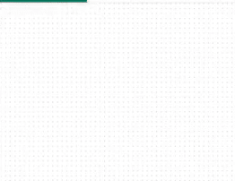

<h2 class="c-project-heading--task">Make CSV into chart</h2>
--- task ---
Use `int()` to convert a string to a number and load into a chart
--- /task ---

Load your data into the chart by making two new lists

`team = pieces[0]` is used as a label on the chart. 

`medals = pieces[1]` is used as the bar.

Use `chart.add()` to index the new lists. `int()` turns the `medals` text into a number.

--- code ---
---
language: python
filename: main.py
line_numbers: true
line_number_start: 7 
line_highlights: 12-14
---
with open('medals.csv') as f:
    for line in f:
        #print(line)
        pieces = line.split(',')
        print(pieces)
        team = pieces[0]
        medals = pieces[1]
        chart.add(nation, int(medals))  # Make medals a number
--- /code ---

**Test:** Run your code and look at the chart it creates. Try hovering over some of the bars, or clicking on the names of teams to add and remove them from the chart.

{:width="400px"}

### Debugging

If your chart is empty, check that you have `int(medals)` in your `chart.add()`.

If you see a message about an `IndexError`, your code is trying to get a value from a list index that doesn't exist (e.g. `pieces[2]`). To fix this:
 - Check each of your `team` and `medals` variables to be sure you are only using `0` and `1` as indexes.
 - Check the printed `pieces` lists to be sure they have two items: `['Tonga', '1\n']`, not `['Tonga,1\n']`. If they don't, then check that you have `','` in the `()` of `line.split()`.
 - Check you do not have a blank line at the bottom of your .csv file.

