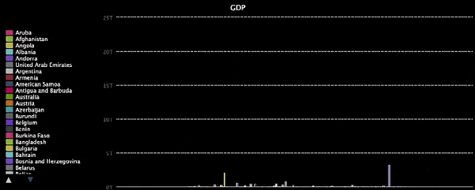

<h2 class="c-project-heading--task">GDP data</h2>
--- task ---
Load large data sets from a file to save a lot of typing!
--- /task ---

### Wealth

A file called `gdp.csv` is part of the starter project. It has data on the annual GDP of different countries. Just like with `pop.csv`, you'll only need to make small changes to use it.

**GDP** is the Gross Domestic Product. It measures the value, in money, of everything produced in an area over a given time period. It can measure how rich an area is.

--- task ---

Change the chart title, the file you are opening, and the category name to draw a chart based on the GDP data in `gdp.csv`.

The `gdp.csv` file stores the GDP as decimal numbers. Update the type from `int` to `float` so that the numbers are in the correct format. 

--- code ---
---
language: python
filename: main.py
line_numbers: true
line_number_start: 6 
line_highlights: 6, 9, 15, 16
---
chart.title = 'GDP'

# Add data to the chart
with open('gdp.csv') as f:
    for line in f:
        #print(line)
        pieces = line.split(',')
        #print(pieces)
        team = pieces[0]
        gdp = pieces[1]
        chart.add(team, float(gdp))  # Make GDP a number
--- /code ---

--- /task ---

--- task ---

Now run your program and look at the chart it draws. 

{:width="500px"}

Hover the mouse over the biggest bars and notice which countries they belong to. Click the names of the really big ones to remove them from the chart; that will let you take a closer look at the others. Did any of the richest countries' teams have very large numbers of medals?

--- /task ---

### What did you find?
What did you discover by using your program to look at this data?

 - There are some signs that the number of people a team has to choose from helps it earn medals.
 - But population doesn't explain how countries like France have so many medals. Or why India doesn't have as many medals as China or the USA.
 - Money seems to explain more. Most of the countries that have lots of medals have high GDPs too.
 - Neither of them explains everything. There are teams that don't follow this pattern.

--- collapse ---
---
title: Jamaica does better than bigger and richer countries
---
This isn't a problem in a maths book. So the answer isn't simple. For example, look at Jamaica. Jamaica doesn't have a large population, or a large GDP. 
 
Mexico, Ireland, Portugal, Saudi Arabia, and Singapore all have more people and more money. They even have more money per person. But Jamaica has won more medals than any of them!

--- /collapse ---

So there's more to what it takes to win Olympic medals than just people and money. What else might it be? What other ideas could you test, and what kind of data would you need to do so?
