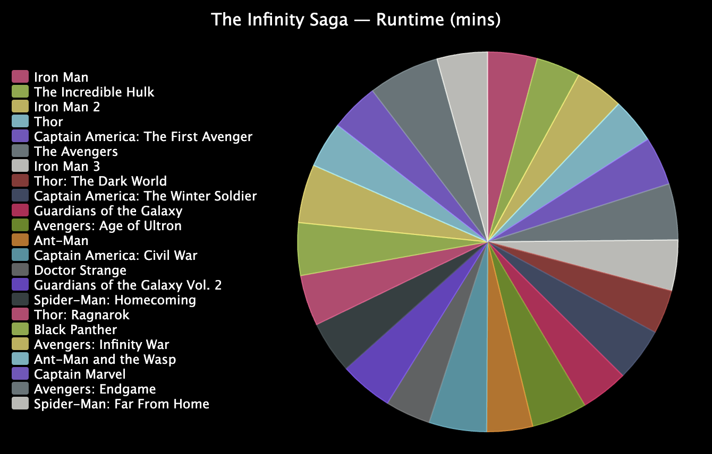

<h2 class="c-project-heading--task">Challenge</h2>
--- task ---
Upgrade your project with a pie chart
--- /task ---

In this step, change how your chart looks, or what data it uses.

{:width="300px"}

### Use a pie chart
Try using a pie chart for a different look, or to show how something is divided.

--- task ---

To create a pie chart instead of a bar chart, change the import from `pygal` to `Pie` instead of `Bar`. Do the same for the function you call to create `chart`. 

--- /task ---

### Use a different set of data
You can load and chart any data that's in a `.csv` file with the program you've written.

--- task ---

**Choose:** Pick a different datafile for your project. There are two available:

 - `mcu.csv` is the runtime and gross income from the Marvel Cinematic Universe films
 - `carbon.csv` is the total (thousands of tons) and per-person (tons) carbon dioxide emissions of different countries and regions

--- /task ---

--- task ---

Update the code that reads from `medals.csv` to read from your new file. 

These files have more than one column of numbers. Use indexes on the `tally` list to choose which to add to your chart. 

The carbon dioxide data uses numbers with decimals. To convert them from text strings, you'll need to use `float()` instead of `int()`.

--- /task ---

--- collapse ---
---
title: Completed project
---

You can view the [completed project here](https://editor.raspberrypi.org/en/projects/charting-champions-example){:target="_blank"}.

--- /collapse ---

--- save ---
