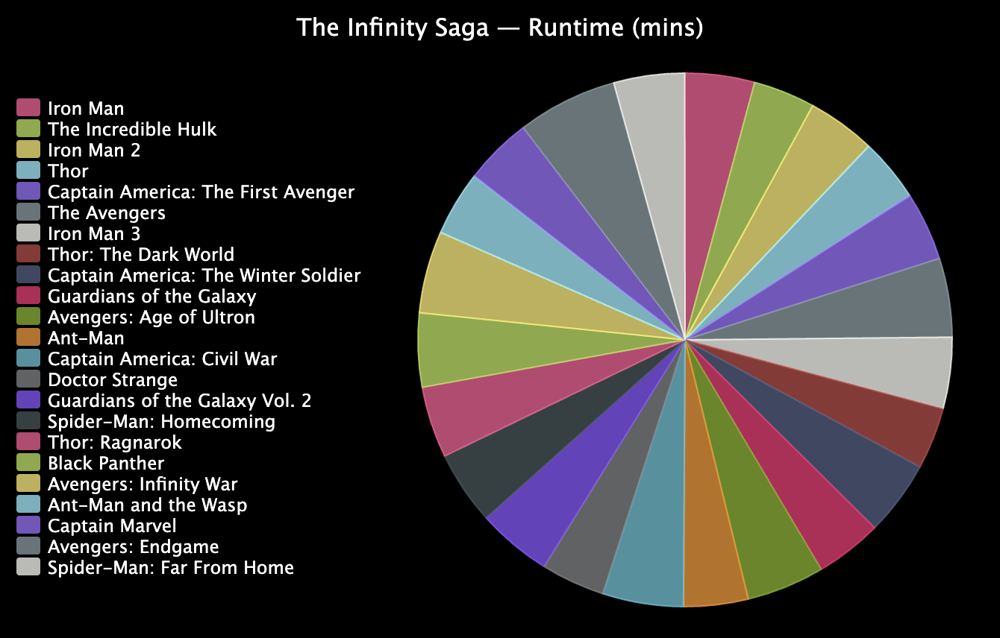

## Challenge

Upgrade your project with a pie chart

In this step, change how your chart looks, or what data it uses.

{:width="300px"}

> [!CHALLENGE]
>
> ## Use a pie chart
>
> Try using a pie chart for a different look, or to show how something is divided.
>
> To create a pie chart instead of a bar chart, change the import from `pygal` to `Pie` instead of `Bar`. Do the same for the function you call to create `chart`.

> [!CHALLENGE]
>
> ## Use a different set of data
>
> You can load and chart any data that's in a `.csv` file with the program you've written.
>
> Pick a different datafile for your project. There are two available:
>
> - `mcu.csv` is the runtime and gross income from the Marvel Cinematic Universe films
> - `carbon.csv` is the total (thousands of tons) and per-person (tons) carbon dioxide emissions of different countries and regions
>
> Update the code that reads from `medals.csv` to read from your new file.
>
> These files have more than one column of numbers. Use indexes on the `pieces` list to choose which to add to your chart.
>
> The carbon dioxide data uses numbers with decimals. To convert them from text strings, you'll need to use `float()` instead of `int()`.

> [!ACCORDION] Completed project
>
> You can view the [completed project here](https://editor.raspberrypi.org/en/projects/charting-champions-example){:target="_blank"}.

> [!SAVE]
